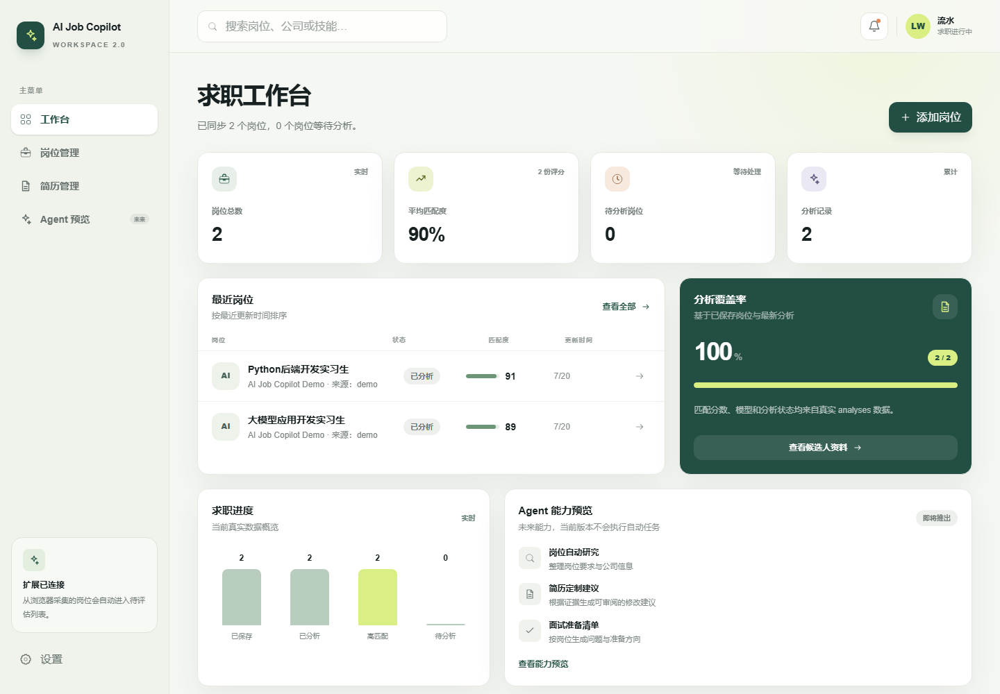
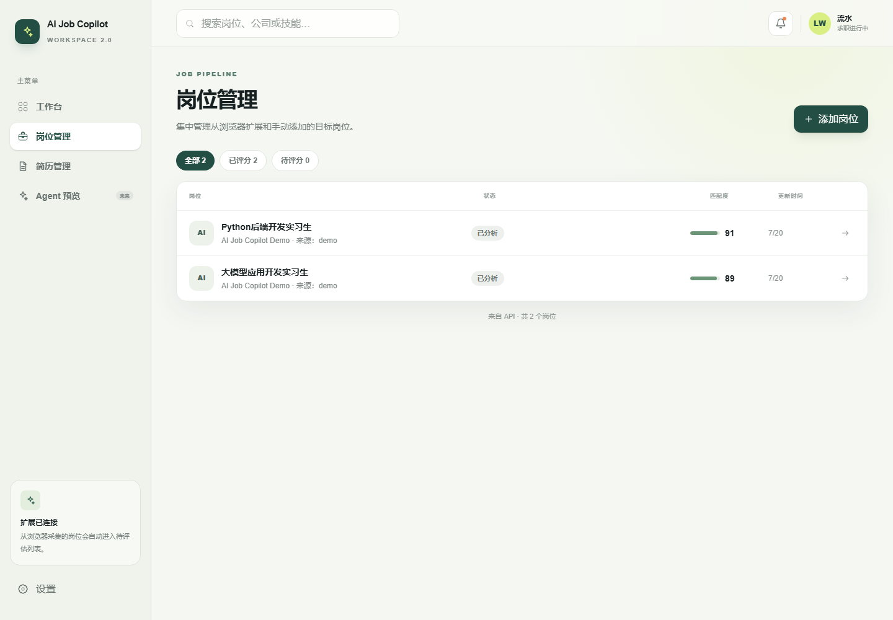
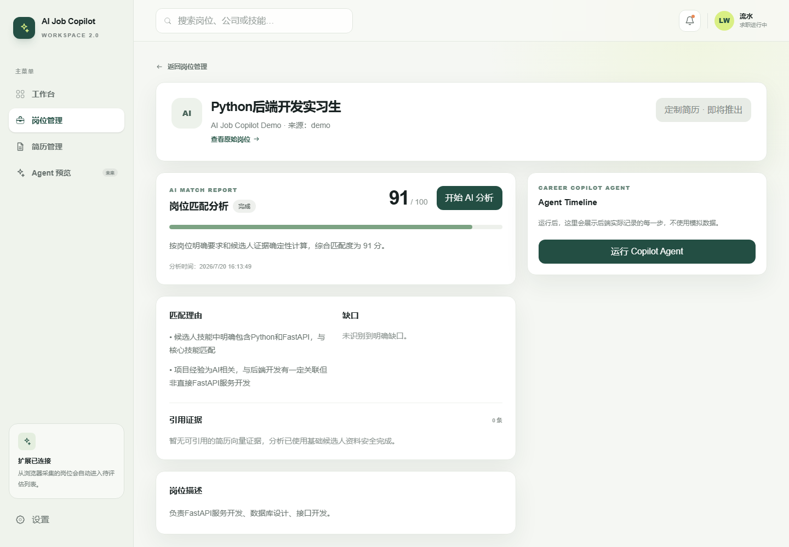
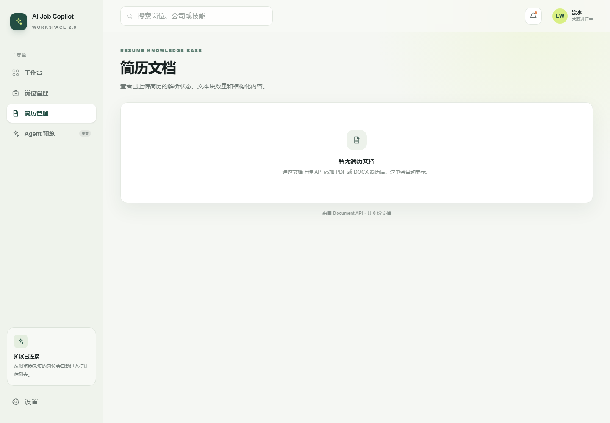
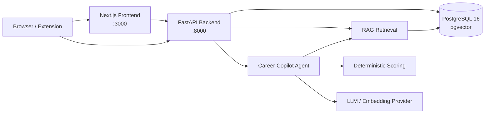

# AI Job Copilot 2.0

AI Job Copilot 是一个可本地运行的 AI 求职工作台：集中管理目标岗位与简历知识库，使用 RAG 检索候选人证据，通过受控 Agent Workflow 生成可解释的岗位匹配分析，并保留浏览器扩展采集 JD 的入口。

> 定位：本地 Demo / 工程作品，不自动投递、不代替用户判断，匹配分数不等于录用概率。

## Demo 预览

| Dashboard | Jobs |
| --- | --- |
|  |  |

| Job Detail | Resume Knowledge Base |
| --- | --- |
|  |  |

## 核心能力

- 岗位管理、候选人画像与分析结果持久化
- PDF / DOCX 简历解析、文本分块与 pgvector 向量检索
- RAG 证据回溯：分析结果关联真实简历片段
- 受控 Career Copilot Agent Workflow 与步骤状态持久化
- LLM 证据提取 + 后端确定性评分
- Manifest V3 浏览器扩展采集招聘页面 JD
- Docker Compose 全栈部署与幂等 Demo Seed

## 普通用户启动方式

前置条件：Windows、Docker Desktop，以及可访问 Docker Hub 的网络环境。

首次使用时，在项目根目录运行一次：

```powershell
powershell.exe -NoProfile -ExecutionPolicy Bypass -File scripts/create_desktop_shortcut.ps1
```

脚本会在当前 Windows 用户桌面创建：

```text
AI Job Copilot Demo
```

以后只需双击这个桌面快捷方式。快捷方式会调用项目内的 `start_demo.bat`，不依赖当前 CMD 或 PowerShell 目录。如果 Docker Desktop 尚未运行，启动窗口会提示先启动 Docker Desktop；服务验证成功后会自动打开 <http://localhost:3000>。

也可以直接双击项目根目录中的：

```text
start_demo.bat
```

启动器会按顺序完成：

1. 检查 Docker daemon。
2. 构建并启动 PostgreSQL、Backend、Frontend。
3. 等待 PostgreSQL / Backend healthy。
4. 显式执行 Alembic migration 到 head。
5. 仅在 Demo 用户表为空时导入 Seed 数据。
6. 验证 Backend 与 Frontend 后打开浏览器。

访问地址：

- Frontend：<http://localhost:3000>
- Backend：<http://localhost:8000>
- Health：<http://localhost:8000/health>

停止 Demo：

```text
stop_demo.bat
```

停止会删除容器与 Compose network，但保留 `aijobcopilot_postgres_data` 数据卷。不要使用 `docker compose down -v`，除非确实要删除本地 Demo 数据。

## 开发者启动方式

开发者可以直接使用 Compose：

```powershell
docker compose up -d
docker compose exec backend python -m alembic -c alembic.ini upgrade head
docker compose exec backend python backend/scripts/seed_demo.py
docker compose ps
```

Seed 是幂等的，但已有 Demo 数据时无需重复执行。Compose 本身不会自动运行 migration；一键 Demo 启动器是明确的本地初始化入口。完整说明见 [DOCKER.md](DOCKER.md)。

## 架构



详细的组件边界、数据流和 Docker 拓扑见 [docs/architecture.md](docs/architecture.md)。

## 技术栈

| 层 | 技术 |
| --- | --- |
| Frontend | Next.js 16、React 19、TypeScript、Tailwind CSS |
| Backend | FastAPI、SQLAlchemy、Pydantic、Uvicorn |
| Database | PostgreSQL 16、pgvector、Alembic |
| AI | OpenAI-compatible LLM / Embedding、RAG、受控 Agent Workflow |
| Browser | Manifest V3 Extension、Native Messaging（Windows / Edge） |
| Deployment | Docker、Docker Compose、named volume、healthcheck |

## Demo 路线

推荐 3 分钟演示顺序：

1. Dashboard：展示岗位、分析、平均匹配度和流程概览。
2. Jobs：打开一个真实 Demo 岗位。
3. Job Detail：展示确定性评分、证据与 Agent 执行步骤。
4. Resume：展示简历文档、分块和语义检索。
5. Architecture：解释 Next.js → FastAPI → PostgreSQL/pgvector → RAG/Agent 数据流。

逐步话术与故障兜底见 [docs/demo-script.md](docs/demo-script.md)，截图规范见 [docs/screenshot-guide.md](docs/screenshot-guide.md)。

## 配置与安全

- 不提交 `.env`、`.env.docker`、真实密码或 API Key。
- Backend 容器可从本地、Git 忽略的 `.env.docker` 读取 LLM / Embedding 配置。
- `DATABASE_URL` 由 Compose 注入并指向内部 `postgres` 服务。
- 浏览器默认通过 `NEXT_PUBLIC_API_BASE_URL=http://localhost:8000` 访问 API；Next.js SSR 通过 Compose 服务名访问 Backend。
- Extension、Native Host、评分、RAG 和 Agent 逻辑与容器部署相互隔离。

## 验证

```powershell
docker compose config
docker compose build
docker compose up -d
docker compose ps
curl.exe http://localhost:8000/health
curl.exe -I http://localhost:3000
docker compose exec backend python -m alembic -c alembic.ini current
docker compose down
```

最近一次 Phase 8.1 本地验收结果：三个容器 healthy，Backend `/health` 返回 HTTP 200，Dashboard、Jobs、Resume、Job Detail 均返回 HTTP 200，Alembic `current == head == 20260720_0007`，停止后 named volume 保留。

## 项目边界

- 当前没有正式账号、鉴权、云同步或多人协作。
- 外部 LLM / Embedding 调用依赖本地配置、网络与供应商可用性。
- 浏览器扩展采用通用启发式提取，不承诺适配所有招聘网站。
- 不提供自动投递、自动聊天或绕过招聘网站限制。
- 当前部署目标是可复现的本地 Demo，不是公网生产环境。
