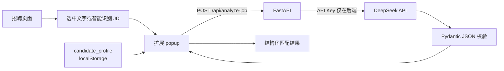

# AI Job Copilot

AI Job Copilot 是一个面向 Microsoft Edge、兼容 Google Chrome 的本地 AI 求职助手 MVP。它通过 Manifest V3 浏览器扩展读取招聘页面中的岗位内容，把用户填写的候选人资料与 JD 一起发送给本地 FastAPI 后端，再由 DeepSeek 生成经过 Pydantic 校验的结构化匹配结果。

> 当前项目只做辅助分析，不自动投递、不自动聊天，也不代替用户判断。AI 输出可能存在偏差，使用前应核对原始 JD 和个人资料。

## 已实现能力

- 岗位内容读取：打开 popup 时自动读取，也可手动重新读取；优先使用用户选中的文字。
- 智能正文识别：对候选区域评分，优先提取岗位详情；未命中时依次回退到 `main`、`article`、`role="main"` 和 `body`。
- 内容清理：过滤部分按钮文案，并裁掉常见的尾部推荐职位区域。
- Edge 优先体验：支持 `Alt+J` 打开扩展；使用 `activeTab` 和 `scripting`，未申请 `<all_urls>`。
- 候选人资料：`candidate_profile` 可编辑，并保存在扩展自己的 `localStorage` 中。
- AI 分析：本地 FastAPI 后端调用 DeepSeek，API Key 不进入扩展端。
- 结构化结果：返回匹配度、摘要、已匹配技能、待补技能、学习建议、判断理由、打招呼文案和置信度。
- 输入输出校验：请求字段和模型 JSON 均由 Pydantic 校验，额外字段被拒绝。
- 异常处理：覆盖缺少配置、认证失败、限流、超时、连接失败和模型响应格式错误等情况。
- 自动化验证：仓库包含 pytest 后端/扩展静态测试和 Node 岗位提取测试；项目也完成过真实 DeepSeek 联调。

## 工作流程



更详细的组件职责、数据流和边界见 [项目架构](docs/architecture.md)。

## 项目结构

```text
backend/
  app/main.py             FastAPI 入口、请求模型与接口
  app/services/llm.py     DeepSeek 调用、响应模型与异常转换
  tests/                  pytest 测试
extension/
  manifest.json           Manifest V3 配置与 Alt+J 快捷键
  content.js              页面岗位内容提取
  popup.html/css/js       交互、资料保存、请求与结果渲染
  tests/content.test.js   Node 提取逻辑测试
docs/                     架构、演示、面试与项目包装材料
```

## 本地运行

### 1. 准备环境

- Python 3.10+
- Node.js（仅运行扩展提取测试时需要）
- Microsoft Edge（推荐）或 Google Chrome
- 可用的 DeepSeek API Key

在项目根目录执行：

```powershell
python -m venv .venv
.\.venv\Scripts\Activate.ps1
pip install -r backend/requirements.txt
Copy-Item .env.example .env
```

在 `.env` 中填写 `LLM_API_KEY`。不要把 `.env` 或真实 Key 提交到 Git。

### 2. 启动后端

```powershell
uvicorn backend.app.main:app --reload --host 127.0.0.1 --port 8000
```

打开 <http://127.0.0.1:8000/health>，返回 `{"status":"ok"}` 即表示服务可用。

仓库也提供：

```powershell
docker compose up --build
```

现有 Compose 配置可启动后端并映射 `8000` 端口，但不会自动把根目录 `.env` 注入容器；如需在容器中调用 DeepSeek，必须另行安全注入环境变量。

### 3. 加载扩展

1. 在 Edge 打开 `edge://extensions/`。
2. 开启“开发人员模式”。
3. 点击“加载解压缩的扩展”，选择仓库中的 `extension` 文件夹。
4. 将扩展固定到工具栏。
5. 打开一个普通招聘详情页，点击扩展图标或按 `Alt+J`。

Chrome 可在 `chrome://extensions/` 中按相同步骤加载。浏览器内置页面、扩展商店等受限页面可能不允许脚本注入。

### 4. 完成一次分析

1. 打开招聘详情页；如页面结构复杂，可先选中完整 JD。
2. 按 `Alt+J`，确认岗位标题、URL 和 JD 已读取。
3. 检查并修改“我的技能 / 简历简介”。
4. 点击“分析岗位”。
5. 核对匹配度、技能差距、学习建议、判断理由和打招呼文案。

## 测试

```powershell
python -m pytest backend/tests
node extension/tests/content.test.js
```

当前文档整理时的结果为：pytest 17 项通过，Node 提取测试通过。真实 DeepSeek 联调依赖个人 API Key，不属于默认自动化测试。

## 当前边界

- 当前是本地 MVP，没有线上部署、账号系统、云端候选人档案或团队协作能力。
- 当前没有数据库或云端部署，也未进行大规模用户验证。
- 页面提取是通用启发式方案，不保证适配所有招聘网站；失败时会回退到更大的正文区域，用户可手动修剪或直接编辑 JD。
- `candidate_profile` 只保存在当前扩展环境的 `localStorage`，不是跨设备同步的简历库。
- 匹配度是模型基于输入生成的辅助判断，仅供参考，不是可证明客观的招聘评分。
- 项目不自动投递、不自动发送消息、不自动刷新岗位，也不绕过网站权限、风控或反爬机制。

## 演示与面试材料

- [Demo 演示脚本](docs/demo-script.md)
- [截图指南](docs/screenshot-guide.md)
- [项目状态说明](docs/project-status.md)
- [面试问答](docs/interview-guide.md)
- [简历项目描述](docs/resume-description.md)
