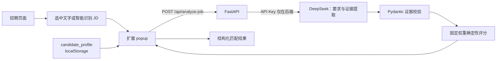

# AI Job Copilot

AI Job Copilot 是一个面向 Microsoft Edge、兼容 Google Chrome 的本地 AI 求职助手 MVP。它通过 Manifest V3 浏览器扩展读取招聘页面中的岗位内容，把用户填写的候选人资料与 JD 一起发送给本地 FastAPI 后端；DeepSeek 提取岗位要求与候选人证据，后端再按固定权重计算可解释的匹配分数。

> 当前项目只做辅助分析，不自动投递、不自动聊天，也不代替用户判断。AI 输出可能存在偏差，使用前应核对原始 JD 和个人资料。

## 已实现能力

- 岗位内容读取：打开 popup 时自动读取，也可手动重新读取；优先使用用户选中的文字。
- 智能正文识别：对候选区域评分，优先提取岗位详情；未命中时依次回退到 `main`、`article`、`role="main"` 和 `body`。
- 内容清理：过滤部分按钮文案，并裁掉常见的尾部推荐职位区域。
- Edge 优先体验：支持 `Alt+J` 打开扩展；使用 `activeTab` 和 `scripting`，未申请 `<all_urls>`。
- 候选人资料：`candidate_profile` 可编辑，并保存在扩展自己的 `localStorage` 中。
- AI 证据提取：本地 FastAPI 后端调用 DeepSeek 提取岗位要求、技能状态和候选人证据，API Key 不进入扩展端。
- 确定性评分：后端按核心技能、加分技能、项目、教育和工作经验的固定权重计算总分，并返回 `score_breakdown`；模型返回的旧 `score` 会被忽略。
- 结构化结果：展示 score 卡片、评分依据折叠区、`matched` / `partial` / `missing` / `unverified` 技能、学习计划、理由及可编辑和复制的 greeting。
- 交互状态：提供后端连接检查、分析 loading/错误状态、防重复提交和结果自动滚动。
- 输入输出校验：请求字段、模型证据 JSON 和最终响应均由 Pydantic 校验。
- 异常处理：覆盖缺少配置、认证失败、限流、超时、连接失败和模型响应格式错误等情况。
- 自动化验证：仓库包含 pytest 后端/扩展静态测试和 Node 岗位提取与 popup 测试；项目曾在合并前完成真实 DeepSeek 联调，合并后的在线联调待手动验收。

## 工作流程



更详细的组件职责、数据流和边界见 [项目架构](docs/architecture.md)。

## 项目结构

```text
backend/
  app/main.py             FastAPI 入口、请求模型与接口
  app/services/llm.py     DeepSeek 证据提取、响应模型与异常转换
  app/services/scoring.py 固定权重确定性评分
  tests/                  pytest 测试
extension/
  manifest.json           Manifest V3 配置与 Alt+J 快捷键
  background.js           Native Messaging 白名单转发
  content.js              页面岗位内容提取
  popup.html/css/js       交互、资料保存、请求与结果渲染
  tests/content.test.js   Node 提取逻辑测试
  tests/popup.test.js     Node popup 交互测试
scripts/                  Windows 后端启动与停止脚本
native_host/              短生命周期 Native Host 与 manifest 模板
install_native_host.bat   当前用户 Edge Host 注册入口
uninstall_native_host.bat 当前项目 Host 安全卸载入口
start_ai_job_copilot.bat  Windows 一键启动入口
stop_ai_job_copilot.bat   Windows 一键停止入口
docs/                     架构、演示、面试与项目包装材料
```

## 本地运行

### 推荐：扩展内按需启动

当前实验性方案支持 Windows + Microsoft Edge。首次使用只需完成一次本地连接安装：

1. 在 `edge://extensions` 开启开发人员模式。
2. 选择“加载解压缩的扩展”，加载项目的 `extension` 文件夹。
3. 复制页面显示的真实扩展 ID；不要猜测 ID。
4. 在项目根目录运行：

   ```powershell
   install_native_host.bat <扩展ID>
   ```

5. 回到 `edge://extensions` 重新加载扩展。

之后打开扩展，点击“启动本地服务”；使用结束后点击“停止本地服务”。首次注册只需做一次，
无需每次运行 BAT，不需要 Docker，也不要求后端开机常驻。Native Messaging Host 是短生命周期
组件，只允许 `status`、`start` 和 `stop`，不会接受任意命令、路径或脚本文本。

卸载本地连接组件时运行：

```powershell
uninstall_native_host.bat
```

卸载不会删除扩展、项目或 `.env`，也不会停止当前后端。`v1.0-mvp` 不包含这项实验功能；
当前实现仍是开发者本地集成，不是面向普通用户的一键安装产品。

### 1. 准备环境

- Python 3.10+
- Node.js（仅运行扩展提取测试时需要）
- Microsoft Edge（推荐）或 Google Chrome
- 可用的 DeepSeek API Key

在项目根目录执行：

```powershell
python -m venv .venv
.\.venv\Scripts\Activate.ps1
pip install -r backend/requirements.txt
Copy-Item .env.example .env
```

在 `.env` 中填写 `LLM_API_KEY`。不要把 `.env` 或真实 Key 提交到 Git。

### 2. 启动后端

Windows 推荐直接双击根目录的 `start_ai_job_copilot.bat`。启动后请保持后端窗口打开；使用完毕后双击 `stop_ai_job_copilot.bat` 停止后端。

也可以手动启动：

```powershell
uvicorn backend.app.main:app --reload --host 127.0.0.1 --port 8000
```

打开 <http://127.0.0.1:8000/health>，返回 `{"status":"ok"}` 即表示服务可用。

仓库也提供：

```powershell
docker compose up --build
```

现有 Compose 配置可启动后端并映射 `8000` 端口，但不会自动把根目录 `.env` 注入容器；如需在容器中调用 DeepSeek，必须另行安全注入环境变量。

### 3. 加载扩展

1. 在 Edge 打开 `edge://extensions/`。
2. 开启“开发人员模式”。
3. 点击“加载解压缩的扩展”，选择仓库中的 `extension` 文件夹。
4. 将扩展固定到工具栏。
5. 打开一个普通招聘详情页，点击扩展图标或按 `Alt+J`。

Chrome 可在 `chrome://extensions/` 中按相同步骤加载。浏览器内置页面、扩展商店等受限页面可能不允许脚本注入。

### 4. 完成一次分析

1. 打开招聘详情页；如页面结构复杂，可先选中完整 JD。
2. 按 `Alt+J`，确认岗位标题、URL 和 JD 已读取。
3. 检查并修改“我的技能 / 简历简介”。
4. 点击“分析岗位”。
5. 核对匹配度、技能差距、学习建议、判断理由和打招呼文案。

## 测试

```powershell
python -m pytest backend/tests
node extension/tests/content.test.js
node extension/tests/popup.test.js
node --check extension/popup.js
node --check extension/content.js
python -m json.tool extension/manifest.json
```

当前功能分支回归结果为：pytest 43 项通过，Node 提取与 popup 测试通过，Native Host、JavaScript 和 Manifest 静态检查通过。真实 Edge 扩展 ID 集成验收与 DeepSeek 在线联调本次未运行。

## 当前边界

- 当前是本地 MVP，没有线上部署、账号系统、云端候选人档案或团队协作能力。
- 当前没有数据库或云端部署，也未进行大规模用户验证。
- 页面提取是通用启发式方案，不保证适配所有招聘网站；失败时会回退到更大的正文区域，用户可手动修剪或直接编辑 JD。
- `candidate_profile` 只保存在当前扩展环境的 `localStorage`，不是跨设备同步的简历库。
- DeepSeek 负责提取要求和证据，后端使用固定权重计算匹配度；确定性只表示相同结构化输入产生相同分数，结果仍是求职辅助参考，不等于录用概率。
- 项目不自动投递、不自动发送消息、不自动刷新岗位，也不绕过网站权限、风控或反爬机制。

## 演示与面试材料

- [Demo 演示脚本](docs/demo-script.md)
- [截图指南](docs/screenshot-guide.md)
- [项目状态说明](docs/project-status.md)
- [面试问答](docs/interview-guide.md)
- [简历项目描述](docs/resume-description.md)
