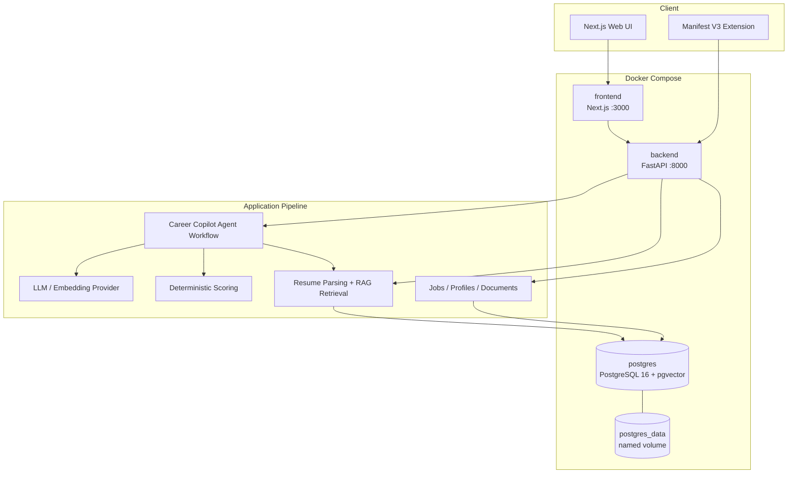
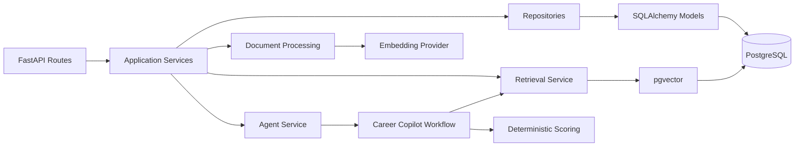
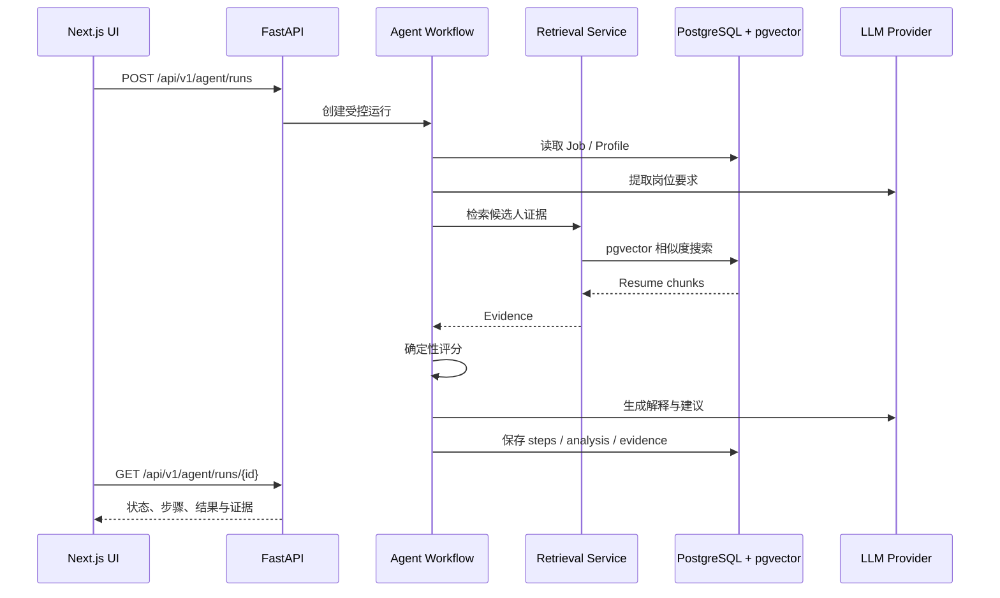
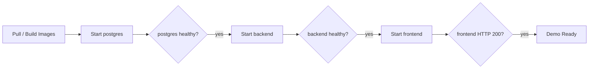

# AI Job Copilot 2.0 架构

## 全栈拓扑

浏览器访问 `localhost:3000`，客户端请求使用 `NEXT_PUBLIC_API_BASE_URL` 访问 `localhost:8000`；Next.js 服务端渲染在 Compose network 内使用 `http://backend:8000`。Backend 通过内部服务名 `postgres:5432` 连接数据库，宿主机不需要知道容器 IP。

## Backend 分层

| 层 | 职责 |
| --- | --- |
| API | HTTP 契约、请求校验、依赖注入与错误映射 |
| Application | CRUD、文档处理、检索、分析与 Agent 生命周期编排 |
| Agent Workflow | 校验输入、提取要求、检索证据、评分、生成并保存结果 |
| Infrastructure | SQLAlchemy、PostgreSQL、pgvector、LLM 与 Embedding provider |
| Scoring | 使用固定状态映射与权重计算结果，不允许模型自由决定最终分数 |

## Agent 与 RAG 数据流

## Docker 启动顺序

Compose 不自动执行 migration。命令行用户显式运行 Alembic；`start_demo.bat` 是面向本地 Demo 的明确初始化入口，会在服务启动后执行 `upgrade head`，并仅在 Demo 用户表为空时 Seed。

## 数据与安全边界

- `.env` 与 `.env.docker` 被 Git 和 Docker build context 排除。
- API Key 只进入 Backend 运行环境，不写入 Frontend、Extension 或镜像层。
- PostgreSQL 使用 named volume 持久化；`docker compose down` 不删除数据。
- PostgreSQL 宿主机端口仅绑定 `127.0.0.1`。
- Backend 与 Frontend 使用非开发启动命令；两个服务都有 healthcheck。
- Extension / Native Host 只负责浏览器采集与本地控制，不承担 RAG、Agent 或评分职责。
- 当前是本地 Demo 架构，没有公网 TLS、正式鉴权、密钥托管、备份策略或高可用设计。
