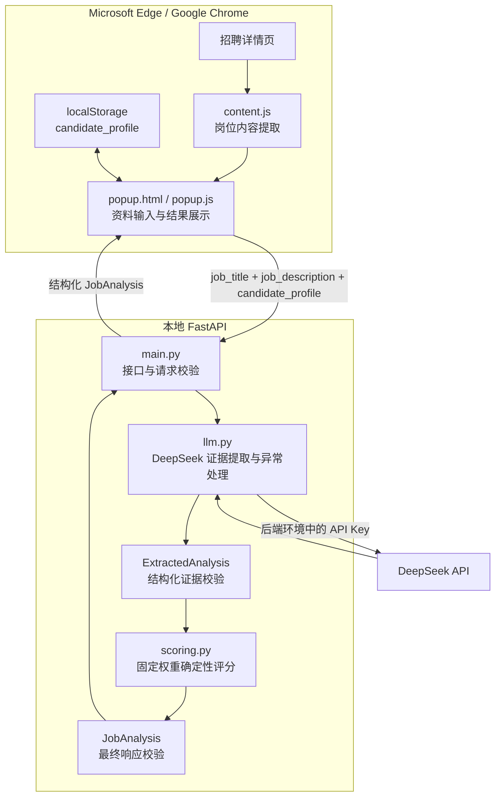
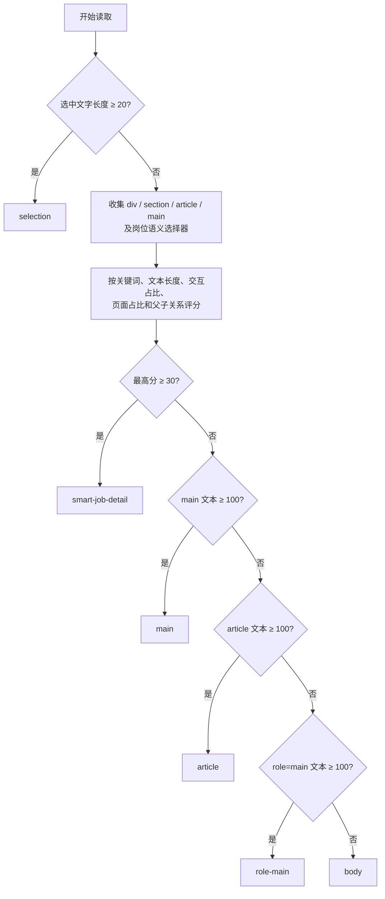

# 项目架构

## 架构目标

AI Job Copilot 将页面读取、用户交互和 AI 服务分成浏览器扩展与本地后端两层。这样既能保留浏览器内的轻量体验，也能让 DeepSeek API Key 只存在于后端运行环境中。



## 组件职责

| 组件 | 真实职责 | 不承担的职责 |
| --- | --- | --- |
| `extension/content.js` | 读取选中文字；寻找并评分岗位详情候选区域；清理部分噪声；执行语义区域回退 | 不持续监听页面，不调用模型，不绕过页面权限 |
| `extension/popup.js` | 自动/手动触发读取；保护用户编辑；保存候选人资料；检查后端；防止重复分析；渲染新版结果并复制 greeting | 不保存 API Key，不在前端实现评分算法 |
| `extension/manifest.json` | 声明 Manifest V3、`activeTab`、`scripting`、本地后端访问和 `Alt+J` | 不申请 `<all_urls>` |
| `backend/app/main.py` | 提供根接口、健康检查和 `/api/analyze-job`；校验三项请求字段；转换服务异常 | 不抓取招聘网页 |
| `backend/app/services/llm.py` | 读取后端配置；调用 DeepSeek 提取要求和证据；解析并校验 JSON；组装最终响应；转换上游异常 | 不接受模型自由决定最终分数，不持久化用户数据 |
| `backend/app/services/scoring.py` | 将技能和经历状态映射为固定分值，按适用维度权重计算 `score` 与 `score_breakdown` | 不调用模型、不读取环境变量，不把分数解释为录用概率 |

## 岗位内容提取顺序



提取结果最长为 8,000 字符。清理逻辑会删除“立即沟通”“收藏”等完全匹配的噪声行，并在正文已足够长时裁掉“推荐职位”“猜你喜欢”“相似职位”等尾部区域。它是通用启发式识别，不等同于对所有招聘网站做了专用适配。

## API 契约

请求：

```json
{
  "job_title": "Python 后端开发",
  "job_description": "岗位职责与任职要求……",
  "candidate_profile": "掌握 Python、FastAPI 和 Git……"
}
```

响应：

```json
{
  "score": 77,
  "score_breakdown": {
    "core_skills": {"score": 80, "weight": 0.5, "applicable": true, "reason": "固定规则说明"},
    "preferred_skills": {"score": 60, "weight": 0.1666666667, "applicable": true, "reason": "固定规则说明"},
    "project_experience": {"score": 70, "weight": 0.2222222222, "applicable": true, "reason": "固定规则说明"},
    "education_background": {"score": 0, "weight": 0.0, "applicable": false, "reason": "岗位未提出教育要求"},
    "work_experience": {"score": 100, "weight": 0.1111111111, "applicable": true, "reason": "固定规则说明"}
  },
  "summary": "按岗位明确要求和候选人证据确定性计算，综合匹配度为 77 分。",
  "matched_skills": ["Python"],
  "partial_skills": ["Redis"],
  "missing_skills": [],
  "unverified_skills": ["Docker"],
  "project_evidence": ["完成过 FastAPI 项目"],
  "education_evidence": [],
  "experience_evidence": [],
  "learning_plan": ["完成一个 Redis 缓存练习"],
  "reasoning": ["候选人资料明确提到 Python"],
  "greeting": "你好，我掌握 Python……",
  "confidence": 0.86
}
```

上例仅展示字段结构，不是固定输出或效果承诺。DeepSeek 只提取要求、证据和离散状态，旧模型响应中的自由 `score` 会被忽略。后端按核心技能 45%、加分技能 15%、项目 20%、教育 10%、工作经验 10% 计算；不适用维度会被排除并重新归一化权重。技能状态固定映射为 matched 100、partial 60、unverified 25、missing 0。请求字段会去除首尾空白并限制长度，最终响应严格校验 `score`、`score_breakdown` 与其他字段。

## 安全与异常边界

- API Key 从项目根目录 `.env` 或操作系统环境变量读取，不发送到扩展端。
- 环境变量优先于 `.env`，文件加载不会覆盖已有环境变量。
- 缺少 Key 或配置不完整返回 503；认证、连接或上游状态异常转换为安全提示；超时返回 504；模型 JSON 无法通过校验返回 502。
- 扩展只声明 `activeTab` 和 `scripting`，并仅为本地 `8000` 端口声明 host permission。
- 当前没有数据库、登录、鉴权、数据加密、服务端持久化或云端部署配置，也未进行大规模用户验证，因此定位为本地 MVP，而非生产系统；确定性评分仍仅供求职辅助参考，不等于录用概率。
